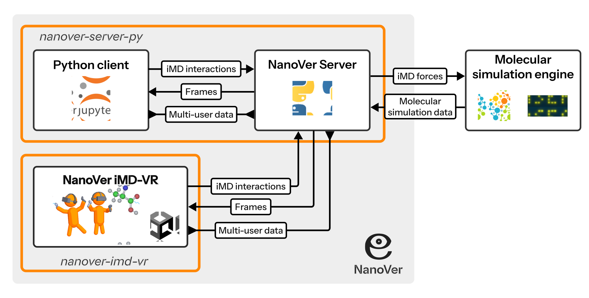

# Summary

<!---
(New suggested version (post-meeting #3))
--->
NanoVer Server is a Python package that facilitates real-time multi-user interactive molecular dynamics (iMD) simulations. It is part of the NanoVer software ecosystem, interfacing with standard molecular dynamics packages to run iMD simulations and serve them to local and remote clients over a network. This package includes a Python client that connects to the server, enabling researchers to incorporate iMD into their existing Python- and Jupyter-based workflows. Furthermore, NanoVer Server interfaces with the NanoVer iMD-VR package to facilitate its primary application: the exploration of molecular systems using interactive molecular dynamics in virtual reality (iMD-VR).

# Statement of need

## Background

For decades, the family of simulation methods encompassed by the umbrella term molecular dynamics (MD) have been indispensable for exploring the temporal evolution and properties of atomic and molecular systems [@alder_phase_1957; @alder_molecular_1958; @alder_studies_1959; @rahman_correlations_1964; @verlet_computer_1967; @mccammon_dynamics_1977]. MD has been used to study a plethora of chemical and biological systems [@van_gunsteren_validation_2018] in a broad range of applications, including prediction of protein structures [@geng_applications_2019], simulation of drug docking in protein-ligand systems [@de_vivo_recent_2017], and characterisation and nano-engineering of materials [@lau_nano_engineering_2018]. One of the major challenges when using MD simulations to explore the dynamics of systems in atomic detail is the sampling of rare events; many significant molecular processes occur over timescales substantially longer than are computationally feasible to model for most researchers, even when harnessing the power of high-performance computing [@yang_enhanced_2019; @kamenik_enhanced_2022]. This is particularly true for biological systems [@hollingsworth_molecular_2018], which often comprise hundreds of thousands of atoms [@brooks_biomolecular_2024]. A wide variety of enhanced sampling techniques have been developed to tackle the issue of insufficient sampling by brute force MD simulations [@henin_enhanced_2022; @yang_enhanced_2019; @kamenik_enhanced_2022]. Families of such techniques include (though are by no means limited to) umbrella sampling [@torrie_nonphysical_1977; @kastner_umbrella_2011], metadynamics [@laio_escaping_2002; @barducci_well_tempered_2008; @valsson_enhancing_2016], steered molecular dynamics [@izrailev_steered_1999; @park_free_2003], replica exchange approaches [@swendsen_replica_1986; @geyer_markov_1991; @sugita_replica_exchange_1999] and adaptive biasing force methods [@darve_calculating_2001; @comer_adaptive_2015]. Though effective, many of these techniques have certain limitations, such as (a) requiring a priori definition of a reaction coordinate, collective variable(s) and/or constraints or restraints on the system; (b) needing a large number of simulation steps and/or multiple parallel simulations; or (c) employing adaptive strategies that are not guaranteed to sample the desired behaviour.

Interactive molecular dynamics (iMD) is a nonequilibrium enhanced sampling method that allows researchers to adaptively bias molecular simulations on-the-fly in real time [@stone_system_2001; @rapaport_interactive_1997; @oconnor_sampling_2018; @oconnor_interactive_2019]. In iMD, researchers can tailor biasing forces in real time in response to the evolving system dynamics, eliminating the need to pre-program perturbations. A number of programs have implementations of iMD, including for example TeraChem [@luehr_ab_2015], SCINE [@weymuth_immersive_2021], and NAMD/VMD [@stone_system_2001], which enable researchers to interact via haptic interfaces with molecular systems visualized on 2-D screens. Fewer programs are available that enable researchers to interact with molecular dynamics simulations in their native 3-D environment, which is especially important for exploring complex molecular structural transformations [@oconnor_sampling_2018]. 

Virtual reality (VR) provides a natural interface for visualising molecular systems by mapping the 3-D simulation space of the molecular system to a 3-D virtual environment that the researcher can inhabit. While several programs already enable molecular visualisation in VR [@doutreligne_unitymol_2014; @bennie_virtual_2023; @pettersen_ucsf_2021; @ozvoldik_yasara_2023; @cassidy_proteinvr_2020; @cortes_rodriguez_molecularwebxr_2025], fewer support the combination of VR-enabled 3-D visualisation with real-time iMD. Performing iMD in VR (iMD-VR) allows users to interact directly with molecular simulations in their native 3-D environment, enabling researchers to reach out and 'touch' molecules as if they were tangible objects [@roebuck_williams_subtle_2020; @roebuck_williams_measuring_2024]. Many studies have demonstrated the utility of iMD-VR for research applications, in areas spanning protein-drug binding, [@deeks_interactive_2020; @deeks_interactive_docking_2020; @henry_chan_discovery_2021; @walters_emerging_2022], protein conformational dynamics [@juarez_jimenez_combining_2020], machine-learning potential energy surfaces [@amabilino_training_2019; @amabilino_training_2020], discovering reaction networks [@shannon_exploring_2021], and chemistry education [@bennie_teaching_2019].

## NanoVer Server

NanoVer is a software ecosystem that employs a server-client architecture to perform quantitative real-time multi-user iMD simulations, with an emphasis on iMD-VR. NanoVer Server facilitates iMD by providing an interface between a molecular simulation engine and connected clients, equipping researchers with tools to interact with the molecular system in real time. NanoVer Server interfaces with several packages that are used to perform, visualise and analyse molecular simulations [@eastman_openmm_2024; @larsen_atomic_2017; @gowers_mdanalysis_2016; @michaud_agrawal_mdanalysis_2011; @nguyen_nglviewinteractive_2018], with particular support for OpenMM. As a Python package, NanoVer Server is well-suited to Python- and Jupyter-based workflows, and can therefore be easily integrated with many of the existing tools of the computational chemistry community and beyond. NanoVer Server is free, open-source, and designed to be customisable and extendable to interface with other molecular simulation engines.

NanoVer Server performs quantitative iMD simulations, delivering on-the-fly metrics about the molecular simulation including energies, particle forces and velocities, and the perturbations induced by the user including the collective user forces, associated potential energy and cumulative work done. As the molecular simulation progresses, simulation data is delivered to connected clients in data structures called 'frames', which provide a snapshot of the state of the system at that point in time. The server allows users to tune the relationship between simulation time and real time during iMD simulations by specifying the number of simulation steps $n$ performed by the molecular simulation engine between frame publishing events. This feature allows users to choose a small simulation time step&mdash;facilitating accurate integration of the equations of motion&mdash;without needing to visualise every simulation step.

To achieve quantitative iMD, the server adopts the following blueprint between the publishing of each frame:

  1) Perform $n$ simulation steps, applying the iMD forces calculated during the previous iteration

  2) Calculate all current iMD forces applied to the system given its current configuration, passing this information to the simulation engine&mdash;these forces will be applied for the next $n$ simulation steps

  3) Compile the data describing the current state of the system (including the iMD forces calculated in step 2) into a frame and publish to the connected client(s)

The blueprint above yields a full description of the forces acting on the molecular system during each timestep, enabling quantitatively accurate analysis of the evolution of the system during iMD interactions.

NanoVer Server interfaces with NanoVer iMD-VR, a VR client that enables researchers to visualise and interact with real-time iMD simulations in virtual reality. The server-client architecture of NanoVer facilitates multi-user iMD-VR by sharing live updates among all connected clients describing each user's current state (e.g. interactions, avatar position). With NanoVer, multiple VR clients can connect to a server to occupy the same virtual environment from the same physical space (colocated clients) and/or from different physical spaces (distributed clients). This flexible structure has great potential for collaborative research: for example, previous iMD-VR frameworks have demonstrated that cloud computing can be used to facilitate real-time multi-user iMD-VR across large physical distances [@jamieson_binnie_narupa_2020; @deeks_interactive_2020; @deeks_free_2023; @glowacki_group_2022]. Furthermore, the communication protocol on which NanoVer Server is built comprises general tools for constructing multi-user VR experiences, the scope of which extend beyond application in computational chemistry.

# Availability

NanoVer Server can be installed as a [conda package](https://anaconda.org/irl/nanover-server) and the source code is available on [GitHub](https://github.com/IRL2/nanover-server-py). The [documentation](https://irl2.github.io/nanover-docs/index.html) is available online, including instructions on [how to install NanoVer Server](https://irl2.github.io/nanover-docs/installation.html).

NanoVer Server also has a suite of [Jupyter notebook tutorials](https://github.com/IRL2/nanover-server-py/tree/main/tutorials), many of which demonstrate how to use the server in conjunction with the [NanoVer iMD-VR client](https://github.com/IRL2/nanover-imd-vr). For new users, the [basics notebooks](https://github.com/IRL2/nanover-server-py/tree/main/tutorials/basics) are a good place to start, which provide hands-on tutorials that introduce many of the key features of NanoVer.

# Acknowledgements

This work is supported by the European Research Council under the European Union’s Horizon 2020 research and innovation programme through consolidator Grant NANOVR 866559, the Axencia Galega de Innovación for funding as an Investigador Distinguido through the Oportunius Program, and the Xunta de Galicia (Centro de investigación de Galicia accreditation 2019–2022, ED431G-2019/04).

INCLUDE BRISTOL FUNDING 

PB is funded by the Royal Society Entrepreneur in Residence Scheme.

LIST OF CONTRIBUTIONS MADE BY AUTHORS

We would also like to thank all previous contributors to NanoVer: a full list of contributors can be found [here](https://github.com/IRL2/nanover-server-py/blob/main/CONTRIBUTORS.md).

We would like to thank the developers of the Python packages used by NanoVer Server, and the Python community as a whole for providing a great ecosystem that facilitates development of free and open source scientific software.

# References